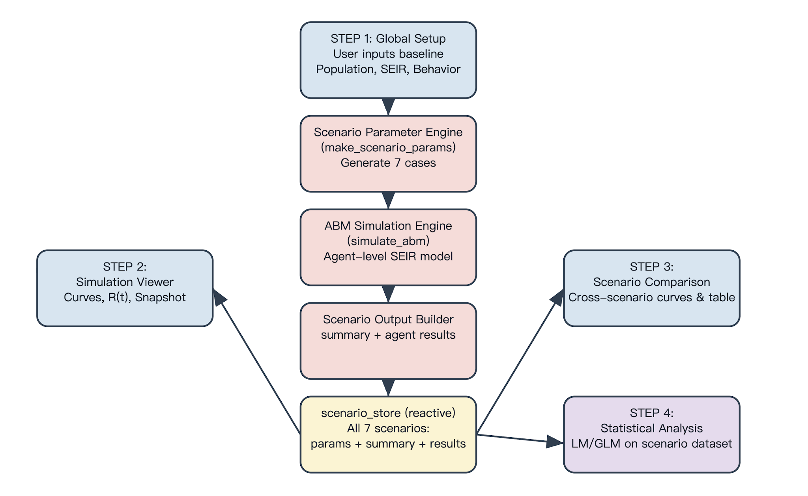

# ABM-SEIR Simulation Platform
> BrownU 2025 Fall PHP2560 Final Project

Zhongyu Fan(zhongyu_fan@brown.edu), Yifei Feng(yifei_feng@brown.edu), Qi Qi(qi_qi@brown.edu)

You can access the **R SHINY APP** from here: https://zhongyu.shinyapps.io/2560FinalProject/

Our **GitHub Page**: https://github.com/fan-zhongyu/ABM-SEIR-Simulation

## 0. Overview, Main Functions and Features, and Usage Instructions
### **Application Overview**

The **ABM-SEIR Simulation Platform** is an interactive web-based tool developed in R/Shiny to model the transmission dynamics of COVID-19. Unlike traditional equation-based deterministic models, this application utilizes an **Agent-Based Model (ABM)** framework combined with **SEIR (Susceptible-Exposed-Infected-Recovered)** compartmental logic. The simulation logic is rooted in the **SEIR compartmental framework** and inspired by the methodology presented in *COVID-ABS: An agent-based model of COVID-19 epidemic* (Silva et al., 2020).

This platform allows researchers and policy analysts to simulate individual agent interactions within a spatial environment, visualizing how different public health interventions—such as social distancing, mask mandates, and lockdowns—impact the trajectory of an epidemic. Beyond simulation, the app integrates a robust statistical module to quantify the efficacy of these interventions using linear regression analysis on the generated synthetic data.

------

### **Main Functions and Features**

**1. Literature-Driven Parameterization**

The application bridges the gap between theory and practice by including a dynamic reference database. Users can view key epidemiological parameters ($R_0$, Incubation Period, Infectious Period) from seminal COVID-19 studies (e.g., Kucharski et al., WHO, Li et al.). Clicking on a reference study automatically populates the simulation global settings with those specific values, ensuring the model is grounded in real-world data.

**2. Stochastic Multi-Scenario Simulation**

The core engine runs a stochastic ABM where agents move and interact in a grid. The platform simultaneously simulates seven distinct intervention scenarios, ranging from "No Prevention" to "Conditional Lockdowns" and "Vertical Isolation." To ensure statistical validity, the application employs Monte Carlo methods, running multiple independent repetitions (user-defined) for each scenario to generate Confidence Intervals (CI).

**3. Interactive Visualization**

- **Temporal Dynamics:** Users can view epidemic curves (Infected counts over time) with 95% confidence ribbons.
- **Spatial Animation:** A playback feature allows users to watch the virus spread across the agent grid day-by-day, color-coded by health state (Blue: Susceptible, Orange: Exposed, Red: Infected, Green: Recovered).

**4. Statistical Analysis**

The application transforms simulation outputs into a dataset for statistical analysis. It fits a Linear Regression model to evaluate:

- **Outcomes:** Peak Prevalence (%) and Day of Peak.
- **Predictors:** Social Distancing, Mask Effectiveness, and Lockdown status.
- **Interaction Effects:** The module visualizes interaction terms (e.g., *Social Distancing × Mask Usage*) to reveal synergistic effects of combined interventions.
- **Diagnostics:** Includes Q-Q plots, Residuals vs. Fitted plots, and correlation heatmaps to assess model validity.

------

### **Usage Instructions**

**Step 1: Setup & Run (Global Configuration)**

1. Navigate to the **"Step 1: Setup & Run"** tab.
2. **Define Parameters:** Use the sliders to set the Population Size ($N$), Transmission Rate ($\beta$), Incubation Rate ($\sigma$), and Recovery Rate ($\gamma$).
3. **Use References (Optional):** Click on a row in the "Reference Epidemiological Parameters" table to automatically load parameters from published scientific literature.
4. **Execute:** Select the number of repetitions (e.g., 50 reps) to balance speed and statistical accuracy, then click **"Run Simulation"**.

**Step 2: Analyze Simulation Results**

1. Once the simulation finishes, go to **"Step 2: Simulation Results"**.
2. **Visual Inspection:** Select a specific scenario (e.g., "Lockdown") from the dropdown.
3. **Animation:** Use the "Day" slider to animate the spatial spread of the virus and observe the epidemic curve evolving in real-time.
4. **Live Counts:** Monitor the dynamic table showing the exact count of S, E, I, and R agents for the selected day.

**Step 3: Scenario Comparison**

1. Navigate to **"Step 3: Scenario Comparison"** to view a comparative line chart overlaying the "Infected" curves for all 7 scenarios.
2. Read the **-Interpretation**, which dynamically identifies the best/worst strategies and evaluates specific interventions (e.g., explaining why Vertical Isolation may have failed compared to Universal Masking).

**Step 4: Statistical Modeling**

1. Proceed to **"Step 4: Statistical Analysis"**.
2. **Configure Model:** Select your Outcome variable (e.g., Peak Prevalence) and Predictors. Check "Fit Full Interactions" to see how interventions work together.
3. **Run Analysis:** Click **"Run Analysis"** to generate the regression model.
4. **Review Outputs:** Explore the Coefficient plot to see effect sizes, check the Correlation Heatmap, and analyze the Interaction Plots to understand non-linear policy effects.
5. **Export:** Click "Download Data (.csv)" to save the aggregated simulation results for external analysis.

## 1. Methods

Unlike aggregate equation-based models, ABM simulates individual agents interacting within a virtual environment.

### Methodological Approach: Monte Carlo Simulations
> Agent-based models are inherently stochastic. A single simulation run represents only one possible trajectory of the epidemic. To ensure statistical robustness, this application utilizes **Monte Carlo methods**. For each scenario, the simulation is executed over $N_{reps}$ independent repetitions. The results are aggregated to compute the Mean and 95% Confidence Intervals (CI).

---

*Figure 1: Workflow of the Agent-Based Model Simulation.*

---

## 2. Key Concepts & Parameters

### Epidemiological Compartments
* **Susceptible (S):** Vulnerable individuals. Probability of infection depends on local prevalence.
* **Exposed (E):** Infected but not yet infectious (Latent period).
* **Infected (I):** Infectious individuals capable of transmitting the virus.
* **Recovered (R):** Immune individuals removed from the transmission chain.

[More compartment SEIR model information available here](https://doi.org/10.1038/s41592-020-0856-2).

### Core Parameters
In our simulation, Transmission Rate ($\beta$), Incubation Rate ($\sigma$), and Recovery Rate ($\gamma$) are the main input parameters.

* **Transmission Rate ($\beta$):** Controls the speed of spread. Related to the Basic Reproduction Number by $R_0 = \frac{\beta}{\gamma}$.
* **Incubation Rate ($\sigma$):** Inverse of the incubation period: $\sigma = \frac{1}{T_{inc}}$. (e.g., 5-day incubation $\to \sigma = 0.2$).
* **Recovery Rate ($\gamma$):** Inverse of the infectious period: $\gamma = \frac{1}{T_{inf}}$. (e.g., 5-day infectiousness $\to \gamma = 0.2$).

## 3. Mathematical Framework

The simulation operates in discrete time steps ($\Delta t = 1 \text{ day}$). Transitions are stochastic (Bernoulli trials) based on the following probabilities.

### A. The Effective Transmission Rate
The raw transmission rate $\beta$ is reduced by interventions (Masks and Social Distancing):

$$\beta_{\text{eff}} = \beta \times (1 - \text{MaskEffect}) \times (1 - \text{SocialDistancing})$$

### B. The Force of Infection ($\lambda$)
The probability of a Susceptible agent meeting an Infected agent depends on the Contact Rate ($c$) and current Prevalence:

$$\lambda = \beta_{\text{eff}} \times c \times \frac{I_{\text{total}}}{N}$$

### C. State Transition Probabilities
Probabilities per time step derived from exponential decay assumptions:

$$P(S \to E) = 1 - e^{-\lambda \Delta t}$$
$$P(E \to I) = 1 - e^{-\sigma \Delta t}$$
$$P(I \to R) = 1 - e^{-\gamma \Delta t}$$

## 4. Statistical Analysis

Simulation analysis involves fitting a linear regression model to the aggregate dataset ($N = \text{Scenarios} \times \text{Repetitions}$). The model quantifies the impact of interventions on outcomes Peak Prevalence and Day of Peak.

### Model Specification with Interactions
To capture the potential effects of combined interventions, the model includes pairwise interaction terms between all selected predictors (Social Distancing, Mask Usage, and Lockdown). The full model takes the form:

$$Y = \beta_0 + \underbrace{\beta_1 SD + \beta_2 Mask + \beta_3 Lockdown}_{\text{Main Effects}} + \underbrace{\beta_{ij} (X_i \times X_j)}_{\text{Interaction Terms}} + \epsilon$$

### Statistical Interpretation: Interaction Effects
* **The Baseline Trap:** In models with interactions, the main effect coefficient represents the outcome only when the interacting variable is zero.
* **Avoid Isolated Interpretation:** When an interaction term is significant, coefficients cannot be interpreted in isolation.
* **Focus on Net Effect:** Evaluate true effectiveness based on the net effect under specific conditions.

## 5. Limitations & Future Work

While this simulation provides valuable insights, the following limitations should be considered:

* **Computational Constraints (Population Size):** Capped at 5,000 individuals due to memory constraints in Shiny.
* **Scenario Scope:** Based on predefined scenarios from Silva et al. (2020), potentially overlooking broader variability.
* **Modeling Assumptions:** OLS Linear Regression is an approximation and may not fully capture non-linear viral dynamics.

## 6. References & Data Sources

* Kucharski, A. J., et al. (2020). Early dynamics of transmission and control of COVID-19: a mathematical modelling study. *The Lancet Infectious Diseases*. [DOI Link](https://doi.org/10.1016/S1473-3099(20)30144-4)
* Li, Q., et al. (2020). Early Transmission Dynamics in Wuhan, China. *NEJM*. [DOI Link](https://www.nejm.org/doi/full/10.1056/NEJMoa2001316)
* Wu, J. T., Leung, K., & Leung, G. M. (2020). Nowcasting and forecasting the potential spread. *The Lancet*. [DOI Link](https://doi.org/10.1016/S0140-6736(20)30260-9)
* WHO. (2020). Statement on IHR Emergency Committee meeting. [View Statement](https://www.who.int/news-room/detail/23-01-2020-statement-on-the-meeting-of-the-international-health-regulations-(2005)-emergency-committee-regarding-the-outbreak-of-novel-coronavirus-(2019-ncov))
* WHO-China Joint Mission. (2020). Final Report. [View PDF](https://www.who.int/docs/default-source/coronaviruse/who-china-joint-mission-on-covid-19-final-report.pdf)
* Liu, T., et al. (2020). Transmission dynamics of 2019-nCoV. *bioRxiv*. [DOI Link](https://www.biorxiv.org/content/10.1101/2020.01.25.919787v2)
* Rocklöv, J., et al. (2020). COVID-19 outbreak on the Diamond Princess. *Journal of Travel Medicine*. [DOI Link](https://doi.org/10.1093/jtm/taaa030)
* Backer, J. A., et al. (2020). Incubation period of 2019-nCoV. *Eurosurveillance*. [DOI Link](https://doi.org/10.2807/1560-7917.ES.2020.25.5.2000062)
* Read, J. M., et al. (2020). Novel coronavirus 2019-nCoV: early estimation. *medRxiv*. [DOI Link](https://doi.org/10.1101/2020.01.23.20018549)
* Bi, Q., et al. (2020). Epidemiology and transmission of COVID-19 in Shenzhen. *The Lancet Infectious Diseases*. [DOI Link](https://doi.org/10.1016/S1473-3099(20)30287-5)
* Tang, B., et al. (2020). Estimation of the Transmission Risk. *Journal of Clinical Medicine*. [DOI Link](https://www.mdpi.com/2077-0383/9/2/462)
* Goh, G. (2020). Epidemic Calculator. [Interactive Tool](https://gabgoh.github.io/COVID/?utm_source=catalyzex.com)
* Silva, P. C. L., et al. (2020). COVID-ABS: An agent-based model of COVID-19 epidemic. *Chaos, Solitons & Fractals*. [DOI Link](https://doi.org/10.1016/j.chaos.2020.110088)
